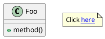

# Issue #7 Research: How Other Tools Support Diagram-to-Source Navigation

This document summarizes research into how other tools implement bidirectional navigation between visualizations and source code, as requested in [Issue #7](https://github.com/eclipse-epsilon/epsilon/issues/7).

## Overview

The primary example mentioned in the issue is the IntelliJ PlantUML plugin, which supports navigating from diagrams back to PlantUML source. This research covers PlantUML's built-in capabilities and how various IDE plugins implement diagram-to-source navigation.

---

## PlantUML Built-in Hyperlink Support

PlantUML natively supports hyperlinks using bracket syntax:



### Syntax Variants

| Syntax | Description |
|--------|-------------|
| `[[URL]]` | Simple link |
| `[[URL Label]]` | Link with custom display text |
| `[[URL{tooltip}]]` | Link with hover tooltip |
| `[[URL{tooltip} Label]]` | Full syntax with tooltip and label |
| `[[[URL]]]` | Triple brackets for class fields/methods |

### Configuration Options

- `skinparam hyperlinkColor` - Change link color
- `skinparam hyperlinkUnderline` - Control underline display
- `skinparam pathHoverColor` - Hover highlight color
- `topurl` - Define prefix for all relative links

### SVG Embedding Requirement

For hyperlinks to be clickable when SVG is embedded in HTML:
- **Must use**: Direct SVG embedding or `<object>` tag
- **Will not work**: `` tag (links are not interactive)

---

## IntelliJ PlantUML Plugin (plantuml4idea)

**Repository**: https://github.com/esteinberg/plantuml4idea

### Implementation Details

1. **Click Handling**: Located in `PlantUmlImageLabel.java`, uses `MouseAdapter` with `mouseClicked` event handler

2. **Link Resolution**: Uses `Desktop.getDesktop().browse(uri)` for standard URLs

3. **Custom Navigation**: Plugin provides its own mechanism for source file navigation:
   - Supports file paths with identifier suffixes: `file.java#methodName`
   - Resolves paths relative to project content roots
   - Avoids browser tab pollution (unlike HTTP API approach)

### Workaround Using IntelliJ HTTP API

```plantuml
[[http://localhost:63342/api/file/src/main/java/com/example/MyApp.java MyApp]]
```

**Limitations**:
- Supports file path and line number references
- Does not support method name targeting
- Each navigation creates an unwanted browser tab

### Plugin Limitations

- PlantUML doesn't provide source positions; navigates to first occurrence only
- Paths containing spaces are not supported
- Requires "Render links" enabled in plugin settings

---

## JetBrains MPS: PlantMPS Plugin

**Documentation**: https://www.jetbrains.com/help/mps/dive-into-plugins-the-plantmps-plugin.html

### Two Implementation Approaches

#### 1. Original mbeddr Approach
- Starts an HTTP server exposing navigation services
- Transforms user clicks on SVG into HTTP requests
- Server processes request and performs IDE navigation

#### 2. PlantMPS Direct Approach
- Uses `MbeddrUserAgent.openLink()` method
- Directly selects the requested node without HTTP intermediary
- More streamlined interaction between SVG and editor

---

## Comparison with Picto Trace System

| Aspect | PlantUML Plugin | Picto Trace System |
|--------|-----------------|-------------------|
| **Encoding Method** | URL in `[[...]]` syntax | Zero-width Unicode characters (`\u2060`) |
| **Visibility** | Visible in source (explicit markup) | Invisible in output |
| **Click Detection** | Native SVG `<a>` hyperlinks | JavaScript detecting ZWC on mouseover |
| **Navigation** | `Desktop.browse()` or custom handler | Java browser functions via SWT |
| **Editing Support** | Not supported | Full support via EMF commands |
| **Undo/Redo** | N/A | Supported via `IEditingDomainProvider` |

### Key Differences

1. **Explicit vs. Implicit Marking**: PlantUML requires explicit URL markup in diagram source; Picto encodes trace information invisibly without modifying visual output.

2. **Read-only vs. Editable**: PlantUML plugins only support navigation (read-only); Picto supports both navigation AND editing of model properties.

3. **Source Format Dependency**: PlantUML approach requires the source to be PlantUML text; Picto works with any EGL-generated content.

---

## Potential Improvements for Picto

Based on this research, potential enhancements could include:

1. **Hybrid Approach**: Support both ZWC encoding (for editing) and standard hyperlinks (for navigation-only elements)

2. **URL Scheme**: Define a custom URL scheme (e.g., `picto://element/property`) that could work alongside ZWC encoding

3. **Tooltip Enhancement**: Add hover tooltips showing element/property information (similar to PlantUML's `{tooltip}` syntax)

4. **SVG Native Links**: For elements that only need navigation (not editing), consider using native SVG `<a>` elements for better accessibility

---

## References

- [plantuml4idea GitHub Repository](https://github.com/esteinberg/plantuml4idea)
- [Issue #352: Hyperlink to method in IntelliJ editor](https://github.com/esteinberg/plantuml4idea/issues/352)
- [Issue #257: Link into source code](https://github.com/esteinberg/plantuml4idea/issues/257)
- [PlantUML Hyperlinks Documentation](https://plantuml.com/link)
- [PlantUML SVG Generation](https://plantuml.com/svg)
- [PlantMPS Plugin Documentation](https://www.jetbrains.com/help/mps/dive-into-plugins-the-plantmps-plugin.html)
- [JetBrains Plugin Marketplace: plantuml4idea](https://plugins.jetbrains.com/plugin/7017-plantuml-integration)
